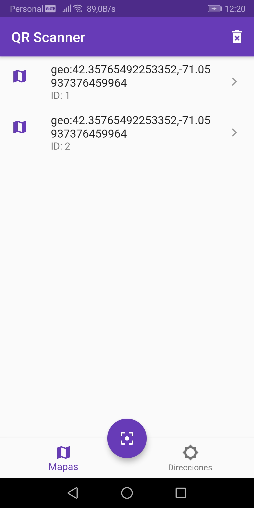
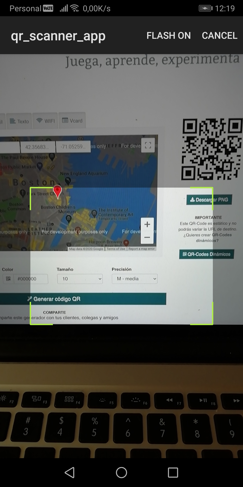
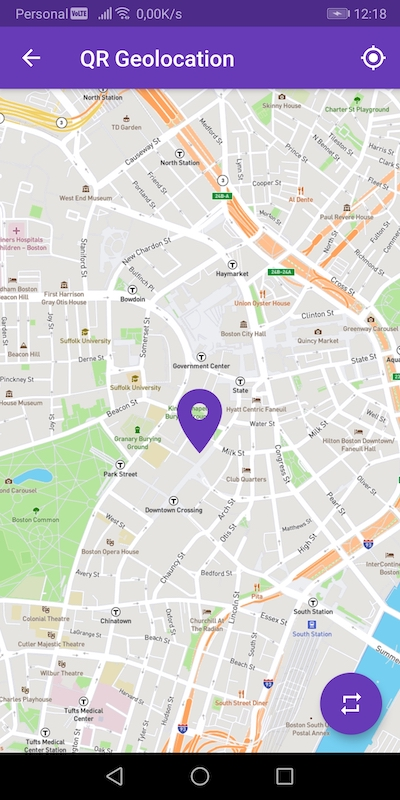

# QR Scanner App

This App uses [QR Barcode Scanner](https://github.com/dm77/barcodescanner), MapBox, SQLite3 for storage.





#### Run the Applicaion

```
flutter devices (Check that Device Emulator is running)
flutter run (to run the application)
```

#### How it works?

With QR Scanner you can get http links or geo location info by reading a QR code using your camera device.
When the data collected is a http link then it will be saved on the directions tab and open it on a new browser window.
When the data collected is a geo location (lat, long) then it will be saved on the maps tab and a Mapbox map will open with the mark on the exactly geo location collected. 

#### Tecnnical Notes

Supported Formats
```
BarcodeFormat.UPC_A
BarcodeFormat.UPC_E
BarcodeFormat.EAN_13
BarcodeFormat.EAN_8
BarcodeFormat.RSS_14
BarcodeFormat.CODE_39
BarcodeFormat.CODE_93
BarcodeFormat.CODE_128
BarcodeFormat.ITF
BarcodeFormat.CODABAR
BarcodeFormat.QR_CODE
BarcodeFormat.DATA_MATRIX
BarcodeFormat.PDF_417
```
### Would you like to extend this app?
This app has many resources and took many hours of work to build all of it, so you can hopefully start your next project on top of it and save all these precious hours and just focus on details and add new features.

Please [buy me a coffee, U$D 5 a good one :-) via [https://www.paypal.me/trailblazersgarage](https://www.paypal.me/trailblazersgarage) and let's coordinate a call on Zoom/Skype or Google Hangout.

You also can contact on trailblazersgarage@gmail.com.

Check more apps on [9dapps.com](http://www.9dapps.com).
Thank you very much!
